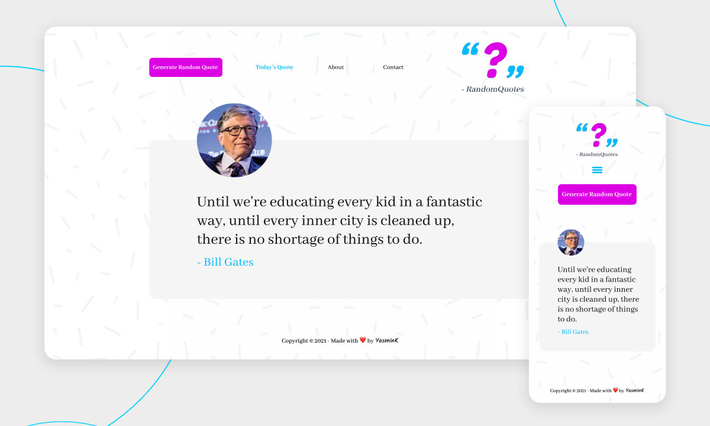

## Random Quotes

A simple website that generates random quotes created to practice coding.  

## Languages

    

## Design

<i>Layout created with </i> 

## Credits

- Linkedin and Codepen logo by: https://www.flaticon.com/authors/pixel-perfect
- Github logo by: https://www.freepik.com/
- Instagram logo by: https://www.freepik.com/s-salvador
